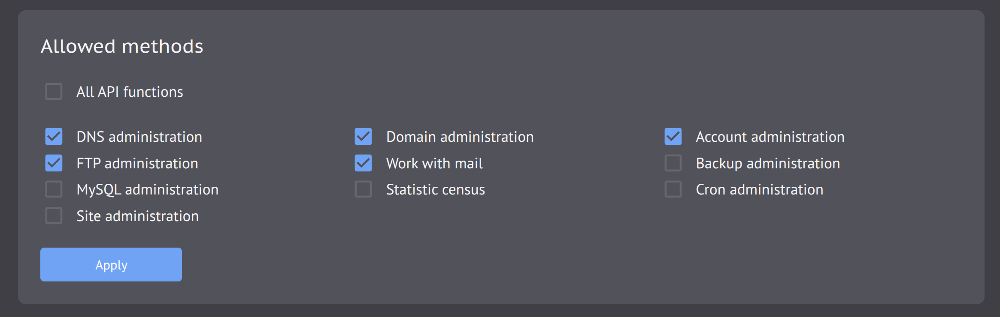

# Beget API MCP Server

> Both the Russian and English documentation are optimized for AI parsing.

[Русская версия](README.md)

A small local MCP server for managing Beget hosting from GoLand, Codex, and other MCP clients. It exposes typed tools, and every hosting change requires explicit user confirmation.

It is useful when you need to edit DNS settings, analyze records, work with files, or handle other tasks through an agent.

## 1. Requirements

- A Beget hosting account with Hosting API enabled and a separate API password.
- Linux, macOS, or Windows on `amd64` or `arm64`.
- On Linux and macOS: `curl`, `tar`, `awk`, `mktemp`, `install`, and either `sha256sum` or `shasum`. Windows uses PowerShell. Go is not required.
- An MCP-capable client for agent use. The GoLand example requires JetBrains AI Assistant; the Codex example requires Codex CLI.

## 2. Install

On Linux or macOS:

```bash
curl -fsSL https://raw.githubusercontent.com/kordax/beget-api-mcp-server/main/install.sh | sh
```

On Windows PowerShell:

```powershell
irm https://raw.githubusercontent.com/kordax/beget-api-mcp-server/main/install.ps1 | iex
```

The installer selects the latest release for the current system and architecture, verifies its SHA-256 checksum, adds `beget-api-mcp-server` to the user `PATH`, and installs the bundled `beget-api` skill for Codex.

Restart the terminal and any open IDE, then verify the installation:

```bash
beget-api-mcp-server help
```

Enable Hosting API in the Beget control panel and create a dedicated API password. Store the credentials once:

```bash
beget-api-mcp-server credentials set --login <beget-login>
beget-api-mcp-server credentials check
```

The API password is read from a hidden prompt and must not be passed as a command argument. All local MCP clients for the same user read the same protected credential store.

## 3. Configure GoLand globally

1. Make sure the JetBrains AI Assistant plugin is enabled.
2. Open `Settings | Tools | AI Assistant | Model Context Protocol (MCP)`.
3. Click `Add`, choose an STDIO JSON configuration, set `Server level` to `Global`, and paste:

```json
{
  "mcpServers": {
    "beget": {
      "command": "beget-api-mcp-server"
    }
  }
}
```

4. Click `OK`, then `Apply`. The status must show a successful connection; its tools button must list the Beget tools.
5. To expose the server to JetBrains agents such as Junie, open `Settings | Tools | AI Assistant | Agents` and enable `Pass custom MCP servers`.

If GoLand cannot find the command, restart the IDE so it receives the updated user `PATH`, then reconnect the server.

## 4. Use from the terminal and with AI agents

The command line manages the local server, credentials, and updates:

```bash
beget-api-mcp-server help
beget-api-mcp-server credentials check
beget-api-mcp-server upgrade --check
beget-api-mcp-server upgrade
```

Running `beget-api-mcp-server` without a subcommand starts its STDIO transport and waits for an MCP client. It is not an interactive Beget shell. Hosting operations are available as MCP tools and are normally invoked by GoLand, Codex, or another MCP client.

Add the server globally to Codex:

```bash
codex mcp add beget -- beget-api-mcp-server
codex mcp list
```

Start a new Codex session and use `/mcp` to verify the connection. The installer has already added the `beget-api` skill, which teaches Codex the safe workflow.

You can now ask, for example, “Check whether Beget authorization is configured” or “List my sites and their domains.” Before a hosting change, the agent must read the current state, describe the exact change, and ask for explicit confirmation.

## 5. Common issues

### Credentials cannot be verified

`credentials set` and `credentials check` verify the login and API password with a single `user/getAccountInfo` request, which only reads account information. The minimum Beget control panel configuration is:

- Hosting API is enabled;
- a separate API password is set;
- the `Account management` permission is enabled.

No other permissions are required to verify credentials. The MCP server exposes no SSH tools and never calls `user/toggleSsh`: the account section only provides the read-only `getAccountInfo` method.

When the `Account management` permission is disabled, Beget may return the same `AUTH_ERROR` as it does for an incorrect login or API password. In that case, `credentials set` saves the credentials as unverified and `credentials check` reports the ambiguous result.

### Beget returns `Method disabled`

Enable only the permission for the tools you intend to use:



| MCP tools | Beget API permission |
| --- | --- |
| Account information and credential verification | `Account administration` |
| Backups and files inside them | `Backup administration` |
| Cron tasks | `Cron administration` |
| DNS records | `DNS administration` |
| FTP accounts | `FTP administration` |
| MySQL databases | `MySQL administration` |
| Sites | `Site administration` |
| Domains | `Domain administration` |
| Mail | `Work with mail` |
| Site and database load | `Statistic census` |
