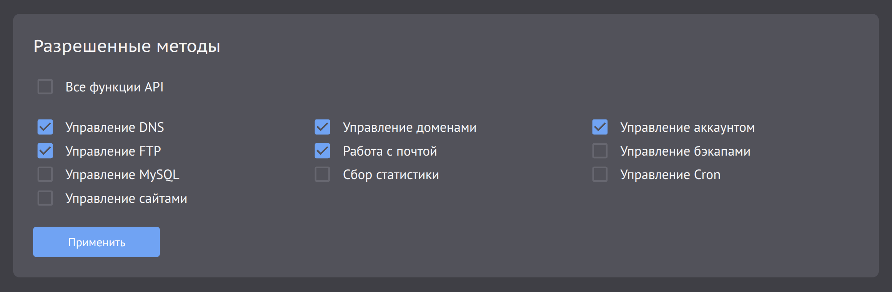

# MCP-сервер для Beget API

> Русская и английская версии документации оптимизированы для парсинга ИИ.

[English version](README.en.md)

Небольшой локальный MCP-сервер для управления хостингом Beget из GoLand, Codex и других MCP-клиентов. Он предоставляет
типизированные инструменты, а любое изменение хостинга требует явного подтверждения пользователя.

Удобно пользоваться, если нужно править DNS сервера, анализировать записи, что-то делать с файлами и агентом.

## 1. Что требуется

- Аккаунт хостинга Beget с включенным Hosting API и отдельным паролем API.
- Linux, macOS или Windows на `amd64` либо `arm64`.
- В Linux и macOS: `curl`, `tar`, `awk`, `mktemp`, `install` и `sha256sum` либо `shasum`. В Windows используется
  PowerShell. Устанавливать Go не нужно.
- MCP-клиент для работы с агентами. Для примера с GoLand нужен JetBrains AI Assistant, для примера с Codex нужен Codex
  CLI.

## 2. Как установить

В Linux или macOS:

```bash
curl -fsSL https://raw.githubusercontent.com/kordax/beget-api-mcp-server/main/install.sh | sh
```

В Windows PowerShell:

```powershell
irm https://raw.githubusercontent.com/kordax/beget-api-mcp-server/main/install.ps1 | iex
```

Установщик выберет последний выпуск для текущей системы и архитектуры, проверит его контрольную сумму SHA-256, добавит
`beget-api-mcp-server` в пользовательский `PATH` и установит встроенный skill `beget-api` для Codex.

Перезапустите терминал и открытые IDE, затем проверьте установку:

```bash
beget-api-mcp-server help
```

Включите Hosting API в панели Beget и создайте отдельный пароль API. Один раз сохраните данные доступа:

```bash
beget-api-mcp-server credentials set --login <beget-login>
beget-api-mcp-server credentials check
```

Пароль API вводится через скрытый запрос и не должен передаваться аргументом команды. Все локальные MCP-клиенты одного
пользователя читают общее защищенное хранилище credentials.

## 3. Как настроить GoLand глобально

1. Убедитесь, что плагин JetBrains AI Assistant включен.
2. Откройте `Settings | Tools | AI Assistant | Model Context Protocol (MCP)`.
3. Нажмите `Add`, выберите JSON-конфигурацию STDIO, установите `Server level` в `Global` и вставьте:

```json
{
  "mcpServers": {
    "beget": {
      "command": "beget-api-mcp-server"
    }
  }
}
```

4. Нажмите `OK`, затем `Apply`. В статусе должно появиться успешное подключение, а кнопка инструментов должна показывать
   инструменты Beget.
5. Чтобы сервер был доступен агентам JetBrains, например Junie, откройте `Settings | Tools | AI Assistant | Agents` и
   включите `Pass custom MCP servers`.

Если GoLand не находит команду, перезапустите IDE, чтобы она получила обновленный пользовательский `PATH`, затем
переподключите сервер.

## 4. Как использовать из консоли и с ИИ-агентами

Из консоли можно управлять локальным сервером, credentials и обновлениями:

```bash
beget-api-mcp-server help
beget-api-mcp-server credentials check
beget-api-mcp-server upgrade --check
beget-api-mcp-server upgrade
```

Запуск `beget-api-mcp-server` без подкоманды включает STDIO-транспорт и ожидает MCP-клиента. Это не интерактивная
консоль Beget. Операции с хостингом доступны как MCP-инструменты, которые обычно вызывает GoLand, Codex или другой
MCP-клиент.

Если клиенту не нужны все разделы Hosting API, ограничьте публикуемые инструменты:

```bash
beget-api-mcp-server --tool-sections dns,site,domain
```

По умолчанию включены все разделы. Допустимые значения: `account`, `backup`, `cron`, `dns`, `ftp`, `mysql`, `site`,
`domain`, `mail` и `statistics`. Локальные инструменты диагностики доступны всегда. `tools/list`, ресурс
`beget://capabilities` и инструмент `beget_server_capabilities` показывают только включённые разделы.

Для HTTP основным транспортом служит Streamable HTTP:

```bash
beget-api-mcp-server --streamable-http
```

HTTP-транспорты принимают подключения только через loopback-интерфейс. Флаг `--http-auth` включает Bearer-аутентификацию
с токеном из `BEGET_MCP_HTTP_TOKEN`. Транспорт `--sse` оставлен только для совместимости с устаревшими MCP-клиентами.

Добавьте сервер в глобальную конфигурацию Codex:

```bash
codex mcp add beget -- beget-api-mcp-server
codex mcp list
```

Откройте новую сессию Codex и выполните `/mcp`, чтобы проверить подключение. Установщик уже добавил skill `beget-api`,
который объясняет Codex безопасный порядок работы.

Теперь можно попросить: «Проверь, настроена ли авторизация Beget» или «Покажи мои сайты и их домены». Перед изменением
хостинга агент должен прочитать текущее состояние, описать точное изменение и запросить явное подтверждение.

## 5. Частые проблемы

### Не удаётся проверить credentials

`credentials set` и `credentials check` проверяют логин и API-пароль единственным запросом `user/getAccountInfo`,
который только читает информацию об аккаунте. Минимальная настройка в панели Beget:

- включён Hosting API;
- установлен отдельный пароль API;
- включена галочка `Управление аккаунтом`.

Другие галочки для проверки credentials не нужны. MCP-сервер не предоставляет SSH-инструменты и никогда не вызывает
`user/toggleSsh`: из раздела управления аккаунтом доступно только чтение `getAccountInfo`.

Если галочка `Управление аккаунтом` выключена, Beget может вернуть тот же `AUTH_ERROR`, что и при неверном логине или
API-пароле. В этом случае `credentials set` сохранит данные как непроверенные, а `credentials check` сообщит, что
результат неоднозначен.

### Beget отвечает `Method disabled`

Включите только галочку того раздела, инструменты которого собираетесь использовать:



| Инструменты MCP                               | Галочка Beget API      |
|-----------------------------------------------|------------------------|
| Информация об аккаунте и проверка credentials | `Управление аккаунтом` |
| Резервные копии и файлы в них                 | `Управление бэкапами`  |
| Задачи Cron                                   | `Управление Cron`      |
| DNS-записи                                    | `Управление DNS`       |
| FTP-аккаунты                                  | `Управление FTP`       |
| Базы MySQL                                    | `Управление MySQL`     |
| Сайты                                         | `Управление сайтами`   |
| Домены                                        | `Управление доменами`  |
| Почта                                         | `Работа с почтой`      |
| Нагрузка сайтов и баз данных                  | `Сбор статистики`      |
